<div align="center">

# quiz1v1

**Aptitude practice and live 1v1 quiz duels for campus placements and competitive exams.**

### 🌐 [quiz1v1.tech](https://quiz1v1.tech)

Free to use. No credit card. Sign up with email, Google or GitHub and start in under a minute.

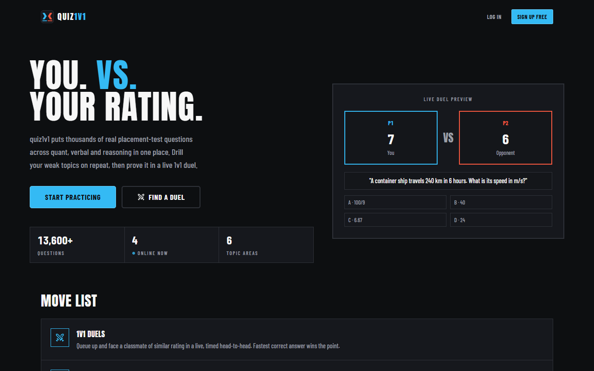

</div>

## What is quiz1v1?

Most aptitude prep is a list of questions to read through. quiz1v1 turns it into a game:

- **Practice solo** on 13,600+ real placement-style questions across six topic areas.
- **Duel another student** live, 1v1, and let the fastest correct answers win.
- **Fix your weak spots.** Every miss is tracked, and missed questions come back sooner until you get them right.
- **See yourself improve** with a rating, leagues, a leaderboard, streaks and per-topic accuracy.

It is built for students preparing for campus placement tests and for banking, SSC and similar exams that test
quantitative aptitude, data interpretation, verbal ability and reasoning.

## How it works

### 1. Your arena

After signing in, the Arena is your home base. It shows your rating and league, rank, streak, XP and accuracy at a
glance, tells you how many questions are **due for review**, and gives you two ways to play: queue for a duel or
start practising.

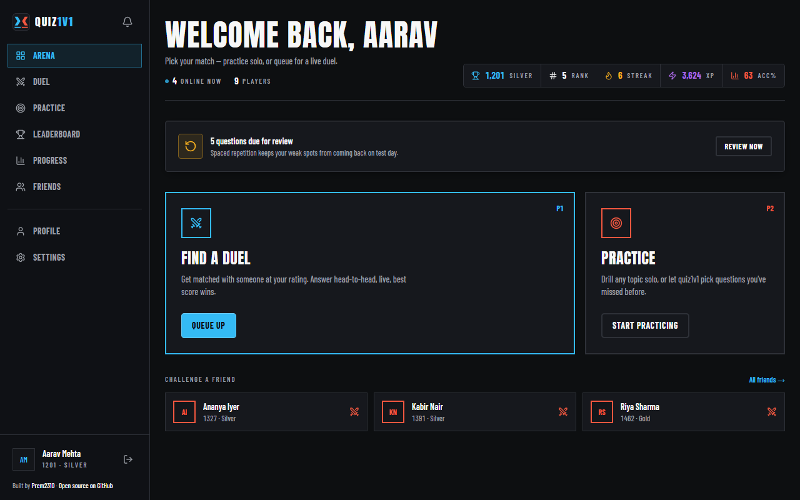

### 2. Practice

Pick what to drill and quiz1v1 builds the session for you.

- **Smart practice** serves the questions you are due to review first, then new ones weighted toward your weaker
  subtopics. Nothing repeats until you have seen the whole set.
- **Weak topics** drills only the areas you are struggling with. Your weakest subtopics are listed with a one-click
  **Drill** button.
- Choose a **topic** (or narrow to one subtopic), the **number of questions** (5 to 20) and the **seconds per
  question** (15, 30 or 45).

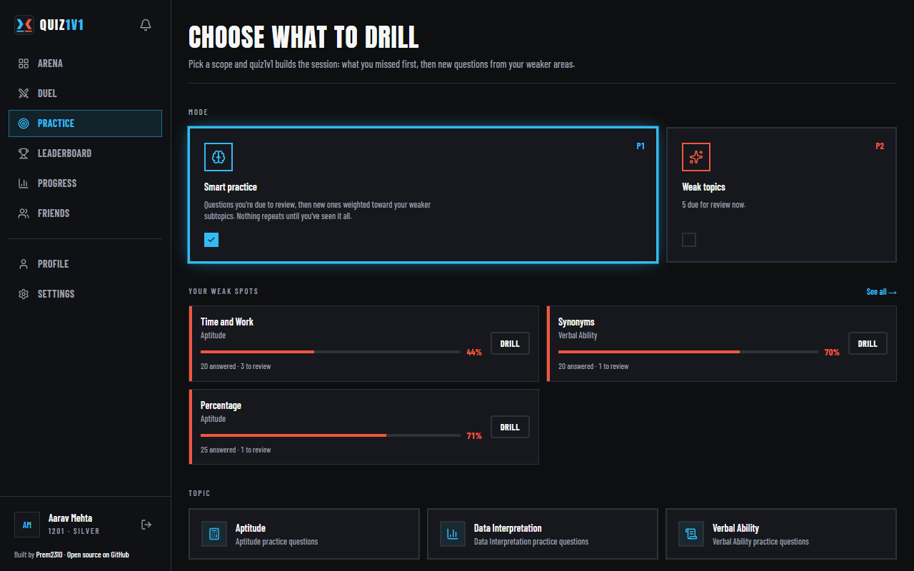

Each question is timed. Tap an option or press **A / B / C / D** on the keyboard.

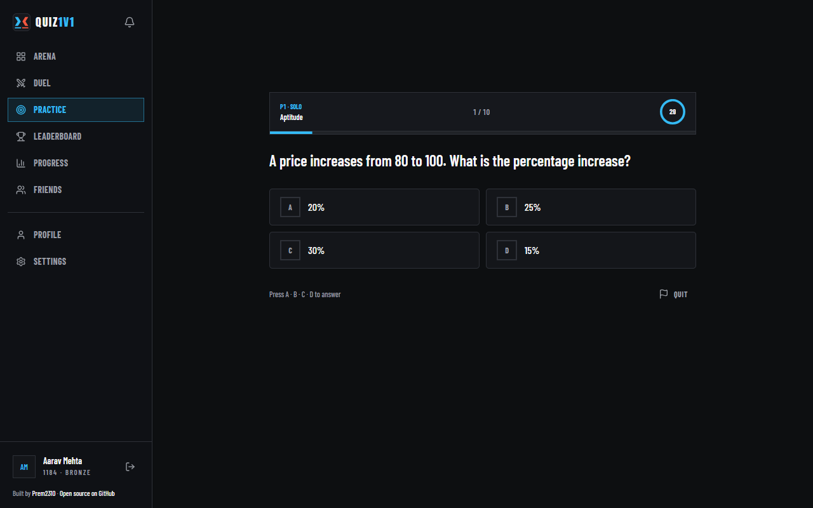

When the session ends you get your accuracy, correct and missed counts and the XP you earned, then a full **review of
every answer** with the correct option and an explanation. One click on **Drill my misses** starts a new session made of
exactly the questions you got wrong.

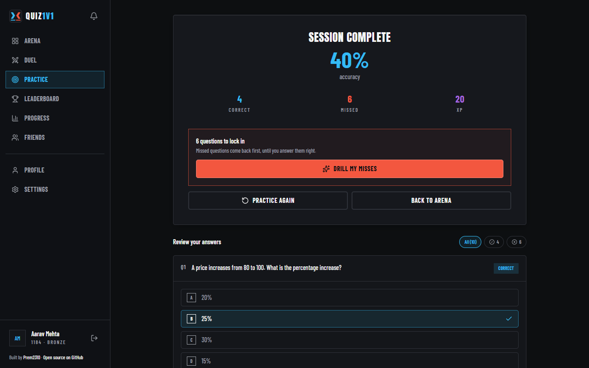

### 3. 1v1 duels

Duels are the reason to come back. Hit **Queue up** and quiz1v1 matches you with someone near your rating (the search
widens the longer you wait). You can also pick a topic to duel on.

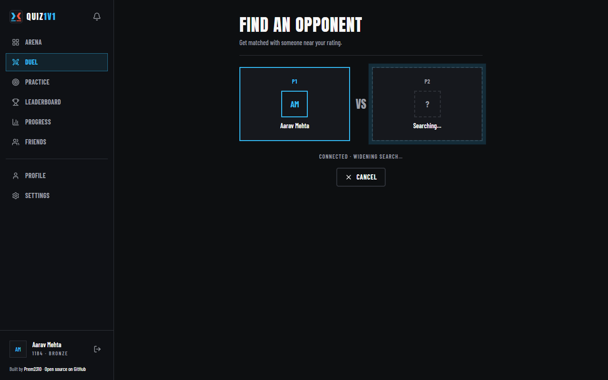

A duel is **10 questions**, answered live by both players at the same time. A correct answer scores base points plus a
**speed bonus**, so being right *and* fast is what wins. You see both scores update as the duel goes.

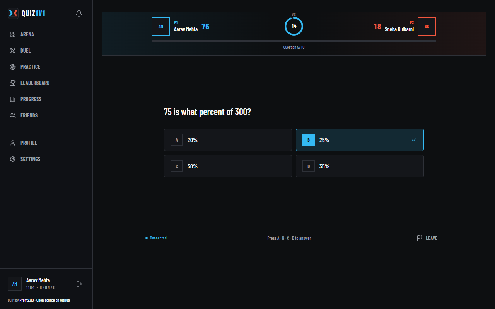

At the end you get the result, your **Elo rating change**, XP earned, and your **head-to-head record** against that
opponent, with **Rematch** and **New duel** one click away.

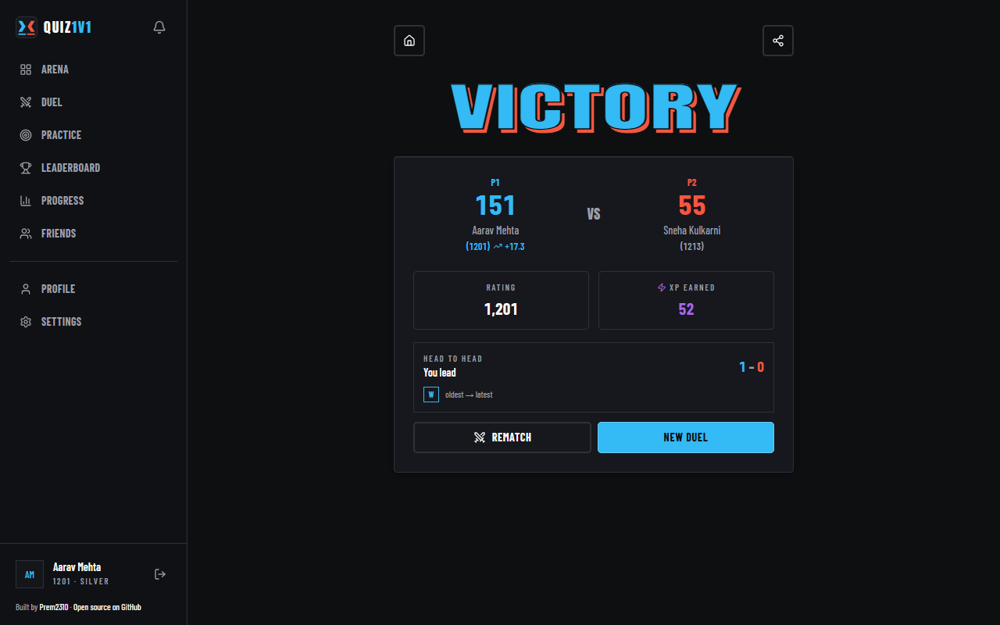

### 4. Track your progress

The **Progress** page shows what is actually improving, over 7, 30 or 90 days:

- questions answered, average accuracy, topics practised and attempts logged
- your **weak spots**, each with a Drill button
- a daily **accuracy trend**, **accuracy by topic** and your full attempt history

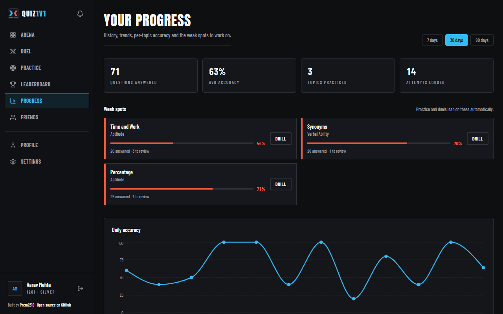

### 5. Rating, leagues and the leaderboard

Everyone starts at a rating of 1000 and moves on an **Elo** scale after every duel. Your rating places you in a league:
**Novice, Bronze, Silver, Gold, Platinum, Diamond**.

The **Leaderboard** ranks players by rating and has three views: **Global**, **College** (only students from your own
college) and **Friends**. Pick your college from a searchable list in Settings; if yours isn't there, add it and it
joins the list for everyone after you.

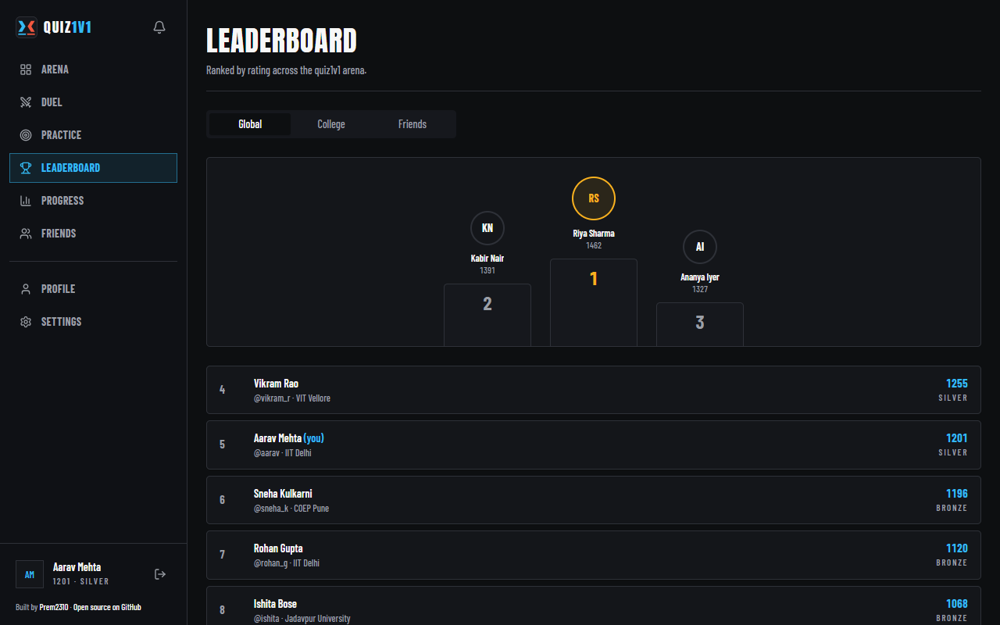

### 6. Friends and challenges

Search for a classmate by username, send a friend request, and once they accept you can **challenge them to a duel**
directly. Notifications tell you when a challenge or request arrives.

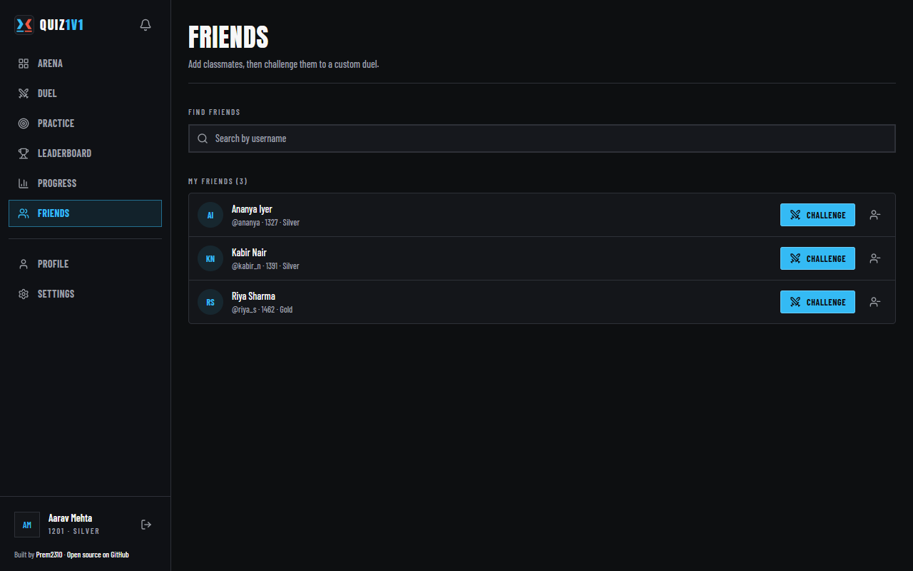

### 7. Your profile

Your profile keeps your rating and best rating, league, current and best streak, duels played, overall accuracy, XP,
accuracy by topic and your recent activity.

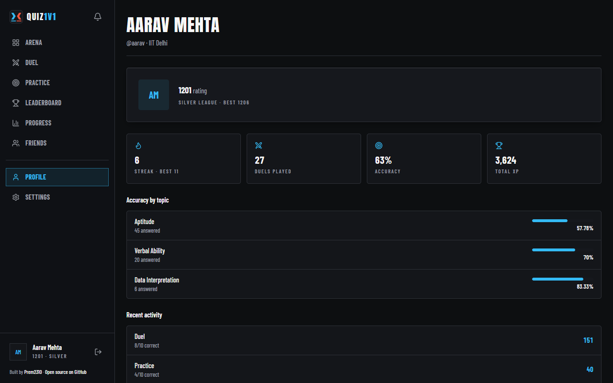

### Works on your phone

The whole app is responsive. On a phone the sidebar becomes a bottom navigation bar, so a practice session or a duel
fits in a spare few minutes.

<div align="center">
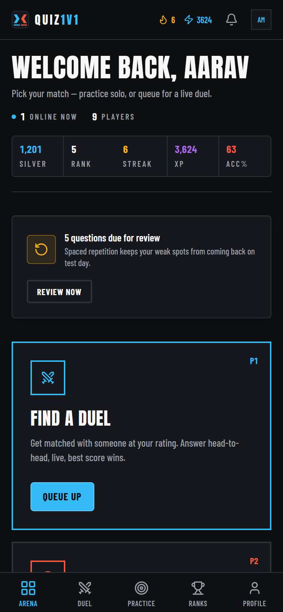
</div>

## Topics

Six areas, all from the IndiaBix question bank, each with its own accuracy tracking and a public explainer page:

| Topic | Covers |
| --- | --- |
| Quantitative aptitude | Percentages, ratios, time and work, averages, interest, number systems |
| Data interpretation | Tables, bar charts, line graphs and pie charts |
| Verbal ability | Grammar, vocabulary, synonyms, antonyms and sentence correction |
| Logical reasoning | Series, arrangements, syllogisms and puzzles |
| Verbal reasoning | Analogies, classification and statement-based reasoning |
| Non-verbal reasoning | Figure series, patterns and analogies |

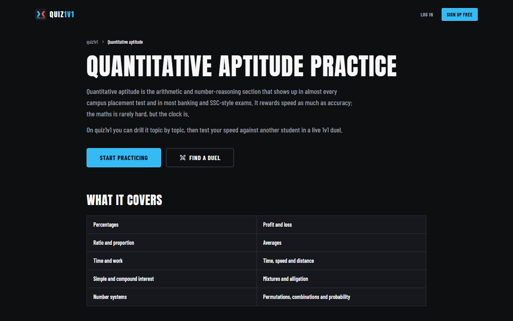

## Built with

| Path | What it is |
| --- | --- |
| `artifacts/quizit` | The web app: React, Vite, TypeScript, Tailwind, shadcn/ui, wouter, TanStack Query |
| `artifacts/api-server` | The API: FastAPI, SQLAlchemy (SQLite or PostgreSQL), Redis (optional), WebSockets for live duels |
| `lib/api-spec` | The OpenAPI spec, the single source of truth for the API |
| `lib/api-client-react`, `lib/api-zod` | Clients and schemas generated from that spec (do not edit by hand) |

Design decisions live in [`artifacts/quizit/DESIGN.md`](artifacts/quizit/DESIGN.md) and the product intent in
[`artifacts/quizit/PRODUCT.md`](artifacts/quizit/PRODUCT.md).

## Run it locally

You need Node 22 with [pnpm](https://pnpm.io) and Python 3.11+ (with [uv](https://docs.astral.sh/uv/) or pip).

```bash
pnpm install

# API (http://localhost:8000). Uses a local SQLite file when no database is configured.
uv sync                                  # or install the dependencies listed in pyproject.toml
pnpm --filter @workspace/api-server run dev

# Web app (http://localhost:5173), in another terminal
pnpm --filter @workspace/quizit run dev
```

Optional: `python artifacts/api-server/scripts/seed_dev_data.py` seeds a small synthetic question bank so practice and
duels work locally (it is not the real IndiaBix import).

Checks before a pull request:

```bash
pnpm run typecheck
pnpm --filter @workspace/quizit run build
cd artifacts/api-server && python -m pytest
```

After changing `lib/api-spec/openapi.yaml`, regenerate the clients with `pnpm --filter @workspace/api-spec run codegen`.

## Contributing

Built by [Prem2310](https://github.com/Prem2310) and open to contributions. See [CONTRIBUTING.md](CONTRIBUTING.md).

## License

The code in this repository is released under the [MIT License](LICENSE).

**The question content is not covered by that license.** The question bank is sourced from
[IndiaBix](https://www.indiabix.com) and all credit for it belongs to IndiaBix. Check their terms before
redistributing any of that content.

_Screenshots use a local demo account with fictional players, not real user data._
